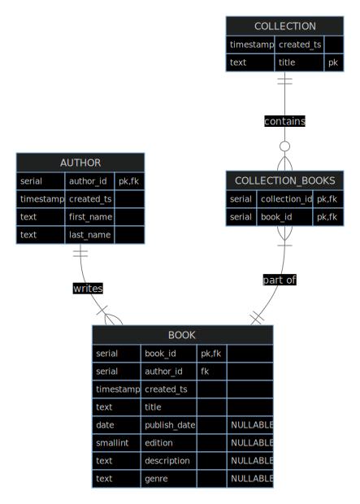

## Feature Addition Design

- What is this feature meant for?
  - To allow users to store books
  - To allow users to store collections of books
  - To allow users to see their collections of books
- How will users interface with this feature?
  - API with self-hosted server
  - CLI
- CLI user experience
  - Books should be entered line by line (e.g., npm init)
  - Collections will be an array of books
    - Stretch goal - real time book title search
  - Gets/Filters/Lists will be returned as JSON or YAML
  - Should match the REST API for ease of use
  - API server should be secondary, CLI primary
  - Should have `help` that needs no further explanation
- REST API
  - Obviously should adhere to REST principles
  - Each API should do one thing and do it well
  - Should match LXD's specification for API design [https://github.com/lxc/lxd/blob/master/doc/rest-api.md](https://github.com/lxc/lxd/blob/master/doc/rest-api.md)
  - Must be designed with the intention of being backwards compatible
  - General design
    - `/<entity>`
      - GET
        - Filter/list all entities
      - POST
        - Create entity
    - `/<entity>/{entity_id}`
      - GET
        - Return single entity
      - PUT
        - Update entity (NOTE: ignoring for sake of time)
      - DELETE
        - Delete entity
  - Entities
    - Book
    - Collection
- Database Model
  - Notes:
    - A book in this context is a copy created at the time of publishing; two of the same book with different editions are different books in this context. This means a unique constraint on the title, author, publish date, and edition.
    - This is a relatively simplified model for brevity
    - Types based on PostgreSQL types
    - A book may have multiple authors; limiting to one for brevity
    - A book may fit multiple genres; limiting to one for brevity
  - 
- Model Validation
  - Note: Only user entered items below
  - Author
    - First Name
      - type=string, minLength=1, maxLength=255
    - Last Name
      - type=string, minLength=1, maxLength=255
  - Book
    - Title
      - type=string, minLength=1, maxLength=4000
    - Publish Date
      - type=string, format=date
    - Edition
      - type=int, minimum=1, maximum=32767
    - Description
      - type=string, maxLength=10000
    - Genre
      - type=string, maxLength=255
  - Collection
    - Title
      - type=string, minLength=1, maxLength=4000
